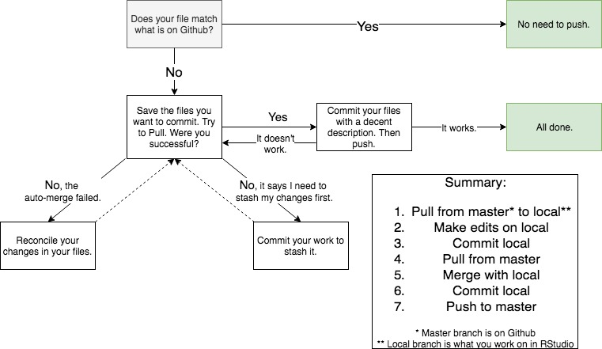

This is the (very) basic website for STAT-S 432, Spring 2019. Rennovation is planned, but I am sure that has been intended for many websites that never made it past their first step.

## Navigation  
* [Course Github](https://github.com/STAT-S432SP2019)  
* [Lecture Notes](https://github.com/STAT-S432SP2019/lectures)
* [Project Guidelines](Project.html)  
* [Schedule](Schedule.html)
* [Slack](https://stat-s432sp2019.slack.com)
* [Syllabus](Syllabus.html)
* Books
    + [AEPV: Shalizi](AEPV.pdf)
    + [ISL: Casella, Fienberg, and Olkin](ISL.pdf)
  
## GitHub Flowchart

The following is a flowchart created by our wonderful TA, Ethan. It is meant to give
a basic idea of using Git in a way that minimizes issues.  
